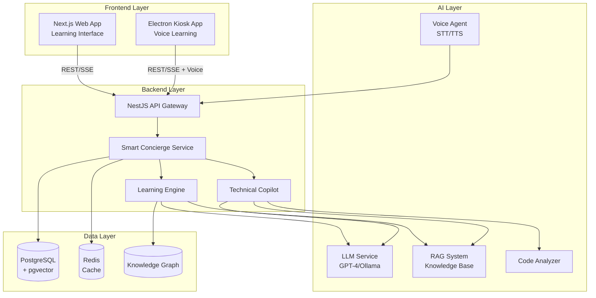
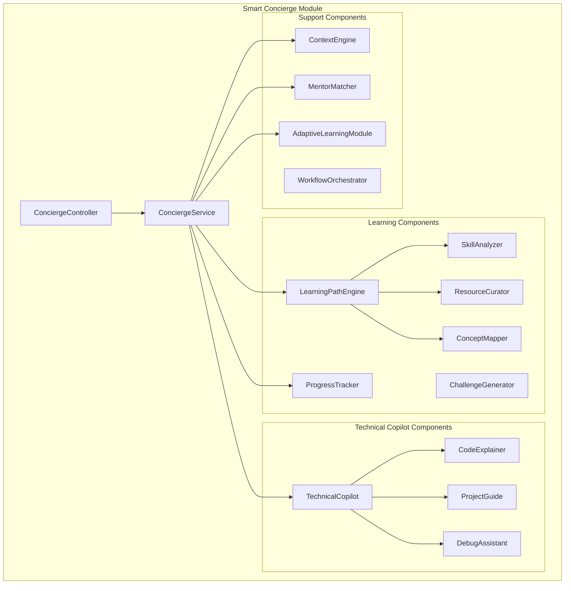

# Design Document: Smart Concierge - Learning Acceleration & Technical Copilot

## Overview

The Smart Concierge is an AI-powered learning acceleration and technical copilot system that helps students and developers learn faster, work smarter, and become more productive while building and understanding technology. The system provides personalized learning paths, real-time technical assistance, intelligent code explanations, project-based guidance, and adaptive mentorship—all through natural conversation across web and kiosk platforms.

Unlike traditional campus management systems that focus on administrative workflows, Smart Concierge prioritizes learning acceleration and technical productivity. Administrative features (mentor booking, resource management, approvals) are streamlined as secondary workflows that support the primary learning mission.

### Key Design Principles

1. **Learning-First Architecture**: Every feature optimized for knowledge acquisition and skill development
2. **Contextual Intelligence**: Understand what the user is building and provide relevant, just-in-time learning
3. **Progressive Disclosure**: Start simple, go deep on demand—match explanation depth to user needs
4. **Learn by Doing**: Emphasize project-based learning with hands-on guidance
5. **Adaptive Teaching**: Personalize explanations, pace, and difficulty to individual learning styles
6. **Leverage Existing Infrastructure**: Reuse IntentService, MemoryService, RAG, and voice-agent
7. **Minimal Schema Changes**: Extend existing models rather than rebuilding
8. **Stateless Design**: Store all state in database/Redis for horizontal scalability

## Architecture

### System Context



### Component Architecture



## Components and Interfaces

### 1. ConciergeController

**Responsibility**: HTTP endpoint handling for learning and technical assistance

**Endpoints**:

```typescript
@Controller('concierge')
export class ConciergeController {
  // Main learning interaction
  @Post('query')
  async processQuery(@Body() dto: ConciergeQueryDto): Promise<ConciergeResponse>
  
  // Learning path generation
  @Post('learning/path')
  async generateLearningPath(@Body() dto: LearningGoalDto): Promise<LearningPath>
  
  @Get('learning/path/:userId')
  async getLearningPath(@Param('userId') userId: string): Promise<LearningPath>
  
  @Post('learning/session')
  async startLearningSession(@Body() dto: LearningSessionDto): Promise<LearningSession>
  
  // Technical copilot
  @Post('copilot/explain')
  async explainCode(@Body() dto: CodeExplanationDto): Promise<CodeExplanation>
  
  @Post('copilot/debug')
  async debugAssist(@Body() dto: DebugRequestDto): Promise<DebugSuggestion>
  
  @Post('copilot/improve')
  async suggestImprovements(@Body() dto: CodeImprovementDto): Promise<ImprovementSuggestion>
  
  // Skill assessment
  @Get('skills/:userId')
  async getSkillProfile(@Param('userId') userId: string): Promise<SkillProfile>
  
  @Post('skills/assess')
  async assessSkills(@Body() dto: SkillAssessmentDto): Promise<SkillAssessment>
  
  // Resource recommendations
  @Get('resources/recommend')
  async recommendResources(@Query() query: ResourceQueryDto): Promise<Resource[]>
  
  // Progress tracking
  @Get('progress/:userId')
  async getProgress(@Param('userId') userId: string): Promise<LearningProgress>
  
  // Challenges
  @Post('challenge/generate')
  async generateChallenge(@Body() dto: ChallengeRequestDto): Promise<Challenge>
  
  @Post('challenge/submit')
  async submitChallenge(@Body() dto: ChallengeSubmissionDto): Promise<ChallengeFeedback>
  
  // Mentor matching (secondary feature)
  @Post('mentor/match')
  async matchMentor(@Body() dto: MentorMatchDto): Promise<MentorRecommendation>
  
  // Voice integration
  @Post('voice/learn')
  async voiceLearning(@Body() dto: VoiceLearningDto): Promise<ConciergeResponse>
}
```

**DTOs**:

```typescript
interface ConciergeQueryDto {
  query: string;
  userId: string;
  projectId?: string;
  codeContext?: string;  // Current code user is working on
  platform: 'web' | 'kiosk';
  inputMode: 'text' | 'voice';
  sessionId?: string;
}

interface ConciergeResponse {
  intent: IntentClassification;
  response: string;
  explanation?: DetailedExplanation;
  suggestions: Suggestion[];
  learningOpportunities: LearningOpportunity[];
  nextSteps: NextStep[];
  visualAids?: VisualAid[];
  confidence: number;
}

interface LearningGoalDto {
  userId: string;
  goal: string;  // e.g., "build an IoT weather station"
  currentSkillLevel?: 'beginner' | 'intermediate' | 'advanced';
  timeCommitment?: string;  // e.g., "2 hours/day"
  preferredLearningStyle?: 'visual' | 'hands-on' | 'reading' | 'mixed';
}

interface LearningPath {
  id: string;
  goal: string;
  phases: LearningPhase[];
  estimatedDuration: string;
  currentPhase: number;
  progress: number;
  skillsToAcquire: Skill[];
  prerequisites: Concept[];
}

interface LearningPhase {
  id: string;
  title: string;
  description: string;
  concepts: Concept[];
  resources: Resource[];
  projects: MiniProject[];
  challenges: Challenge[];
  estimatedTime: string;
  completed: boolean;
}

interface CodeExplanationDto {
  code: string;
  language: string;
  context?: string;
  userId: string;
  explanationDepth: 'brief' | 'detailed' | 'expert';
}

interface CodeExplanation {
  summary: string;
  lineByLine: LineExplanation[];
  keyConceptsUsed: Concept[];
  potentialIssues: Issue[];
  improvements: Improvement[];
  learningOpportunities: LearningOpportunity[];
  visualDiagram?: string;  // Mermaid or ASCII diagram
}

interface SkillProfile {
  userId: string;
  skills: SkillLevel[];
  strengths: string[];
  gaps: SkillGap[];
  recommendedLearning: LearningPath[];
  progressOverTime: ProgressDataPoint[];
}

interface SkillLevel {
  skill: string;
  level: 'novice' | 'beginner' | 'intermediate' | 'advanced' | 'expert';
  confidence: number;
  lastAssessed: Date;
  evidenceCount: number;  // Number of projects/challenges demonstrating this skill
}
```


### 2. ConciergeService

**Responsibility**: Core orchestration for learning and technical assistance

**Interface**:

```typescript
@Injectable()
export class ConciergeService {
  constructor(
    private learningPathEngine: LearningPathEngine,
    private technicalCopilot: TechnicalCopilot,
    private skillAnalyzer: SkillAnalyzer,
    private contextEngine: ContextEngine,
    private resourceCurator: ResourceCurator,
    private mentorMatcher: MentorMatcher,
    private adaptiveLearning: AdaptiveLearningModule,
    private prisma: PrismaService,
    private redis: RedisService
  ) {}
  
  async processQuery(dto: ConciergeQueryDto): Promise<ConciergeResponse>
  async generateLearningPath(goal: string, userId: string): Promise<LearningPath>
  async explainCode(code: string, context: LearningContext): Promise<CodeExplanation>
  async assessSkills(userId: string): Promise<SkillProfile>
  async recommendNextLearning(userId: string): Promise<LearningOpportunity[]>
  async trackProgress(userId: string, activity: LearningActivity): Promise<void>
}
```

**Processing Pipeline**:

```typescript
async processQuery(dto: ConciergeQueryDto): Promise<ConciergeResponse> {
  // 1. Load learning context
  const context = await this.contextEngine.getLearningContext(
    dto.userId, 
    dto.projectId,
    dto.codeContext
  );
  
  // 2. Classify intent with learning focus
  const intent = await this.classifyLearningIntent(dto.query, context);
  
  // 3. Route to appropriate handler
  let response: ConciergeResponse;
  
  switch (intent.category) {
    case 'technical_question':
      response = await this.technicalCopilot.answer(dto.query, context);
      break;
      
    case 'code_explanation':
      response = await this.technicalCopilot.explainCode(dto.codeContext, context);
      break;
      
    case 'learning_path':
      response = await this.learningPathEngine.generatePath(dto.query, context);
      break;
      
    case 'skill_assessment':
      response = await this.skillAnalyzer.assess(dto.userId, context);
      break;
      
    case 'debug_help':
      response = await this.technicalCopilot.debugAssist(dto.query, dto.codeContext, context);
      break;
      
    case 'concept_explanation':
      response = await this.explainConcept(intent.concept, context);
      break;
      
    case 'resource_request':
      response = await this.resourceCurator.findResources(intent.topic, context);
      break;
      
    case 'mentor_request':
      response = await this.mentorMatcher.findMentor(intent.need, context);
      break;
      
    default:
      response = await this.handleGeneralQuery(dto.query, context);
  }
  
  // 4. Identify learning opportunities
  const learningOps = await this.identifyLearningOpportunities(
    dto.query,
    response,
    context
  );
  
  // 5. Generate contextual suggestions
  const suggestions = await this.generateLearningSuggestions(context, intent);
  
  // 6. Adapt to user's learning style
  response = await this.adaptiveLearning.personalizeResponse(
    response,
    context.learningProfile
  );
  
  // 7. Track interaction for learning analytics
  await this.trackLearningInteraction({
    userId: dto.userId,
    query: dto.query,
    intent: intent.category,
    response: response,
    timestamp: new Date()
  });
  
  return {
    ...response,
    learningOpportunities: learningOps,
    suggestions,
    nextSteps: await this.generateNextSteps(context)
  };
}
```

### 3. LearningPathEngine

**Responsibility**: Generate personalized learning roadmaps

**Interface**:

```typescript
@Injectable()
export class LearningPathEngine {
  constructor(
    private skillAnalyzer: SkillAnalyzer,
    private conceptMapper: ConceptMapper,
    private resourceCurator: ResourceCurator,
    private llm: LLMService,
    private knowledgeGraph: KnowledgeGraphService
  ) {}
  
  async generatePath(goal: string, context: LearningContext): Promise<LearningPath>
  async adaptPath(pathId: string, progress: LearningProgress): Promise<LearningPath>
  async suggestNextStep(pathId: string, userId: string): Promise<NextStep>
  async breakDownGoal(goal: string): Promise<LearningPhase[]>
}
```

**Path Generation Strategy**:

```typescript
async generatePath(goal: string, context: LearningContext): Promise<LearningPath> {
  // 1. Analyze the goal
  const goalAnalysis = await this.analyzeGoal(goal);
  // Extract: required technologies, concepts, difficulty level
  
  // 2. Assess current skill level
  const currentSkills = await this.skillAnalyzer.assessSkills(context.userId);
  
  // 3. Identify skill gaps
  const gaps = this.identifyGaps(goalAnalysis.requiredSkills, currentSkills);
  
  // 4. Query knowledge graph for learning paths
  const conceptDependencies = await this.knowledgeGraph.getConceptDependencies(
    goalAnalysis.concepts
  );
  
  // 5. Generate learning phases
  const phases: LearningPhase[] = [];
  
  // Phase 1: Prerequisites (if needed)
  if (gaps.prerequisites.length > 0) {
    phases.push(await this.createPrerequisitePhase(gaps.prerequisites));
  }
  
  // Phase 2-N: Core learning phases
  for (const concept of conceptDependencies.orderedConcepts) {
    phases.push(await this.createLearningPhase(concept, context));
  }
  
  // Final Phase: Capstone project
  phases.push(await this.createProjectPhase(goal, goalAnalysis));
  
  // 6. Curate resources for each phase
  for (const phase of phases) {
    phase.resources = await this.resourceCurator.findResources(
      phase.concepts,
      context.learningProfile
    );
    
    phase.challenges = await this.challengeGenerator.createChallenges(
      phase.concepts,
      currentSkills.level
    );
  }
  
  // 7. Estimate time
  const estimatedDuration = this.estimateDuration(
    phases,
    context.timeCommitment,
    currentSkills.level
  );
  
  // 8. Create and store learning path
  const learningPath: LearningPath = {
    id: generateId(),
    userId: context.userId,
    goal,
    phases,
    estimatedDuration,
    currentPhase: 0,
    progress: 0,
    skillsToAcquire: goalAnalysis.requiredSkills,
    prerequisites: gaps.prerequisites,
    createdAt: new Date()
  };
  
  await this.prisma.learningPath.create({ data: learningPath });
  
  return learningPath;
}

async createLearningPhase(concept: Concept, context: LearningContext): Promise<LearningPhase> {
  return {
    id: generateId(),
    title: `Learn ${concept.name}`,
    description: concept.description,
    concepts: [concept, ...concept.relatedConcepts],
    resources: [],  // Filled later
    projects: await this.generateMiniProjects(concept),
    challenges: [],  // Filled later
    estimatedTime: this.estimateConceptTime(concept, context.learningProfile),
    completed: false,
    learningObjectives: concept.learningObjectives,
    assessmentCriteria: concept.assessmentCriteria
  };
}
```

### 4. TechnicalCopilot

**Responsibility**: Real-time technical assistance and code help

**Interface**:

```typescript
@Injectable()
export class TechnicalCopilot {
  constructor(
    private codeExplainer: CodeExplainer,
    private debugAssistant: DebugAssistant,
    private projectGuide: ProjectGuide,
    private llm: LLMService,
    private rag: RagService
  ) {}
  
  async answer(question: string, context: LearningContext): Promise<ConciergeResponse>
  async explainCode(code: string, context: LearningContext): Promise<CodeExplanation>
  async debugAssist(problem: string, code: string, context: LearningContext): Promise<DebugSuggestion>
  async suggestImprovements(code: string, context: LearningContext): Promise<Improvement[]>
  async guideProjectStep(projectId: string, context: LearningContext): Promise<ProjectGuidance>
}
```

**Technical Question Answering**:

```typescript
async answer(question: string, context: LearningContext): Promise<ConciergeResponse> {
  // 1. Understand the question depth
  const questionAnalysis = await this.analyzeQuestion(question);
  
  // 2. Retrieve relevant knowledge
  const relevantDocs = await this.rag.search(question, {
    filters: {
      relevantTo: context.currentProject,
      skillLevel: context.skillLevel
    }
  });
  
  // 3. Check if this is a learning opportunity
  const isNewConcept = !context.knownConcepts.includes(questionAnalysis.mainConcept);
  
  // 4. Generate answer with appropriate depth
  let answer: string;
  let explanation: DetailedExplanation;
  
  if (isNewConcept) {
    // Provide foundational explanation first
    answer = await this.llm.generate({
      prompt: this.buildTeachingPrompt(question, context, relevantDocs),
      temperature: 0.7
    });
    
    explanation = await this.buildLayeredExplanation(
      questionAnalysis.mainConcept,
      context.skillLevel
    );
  } else {
    // Direct answer for known concepts
    answer = await this.llm.generate({
      prompt: this.buildDirectAnswerPrompt(question, context, relevantDocs),
      temperature: 0.5
    });
  }
  
  // 5. Identify related concepts to explore
  const relatedConcepts = await this.knowledgeGraph.getRelatedConcepts(
    questionAnalysis.mainConcept
  );
  
  // 6. Generate code examples if applicable
  const codeExamples = questionAnalysis.needsCodeExample
    ? await this.generateCodeExamples(questionAnalysis.mainConcept, context)
    : [];
  
  // 7. Create visual aids
  const visualAids = await this.generateVisualAids(questionAnalysis.mainConcept);
  
  return {
    intent: { type: 'technical_question', confidence: 0.95 },
    response: answer,
    explanation,
    suggestions: this.generateFollowUpSuggestions(questionAnalysis, relatedConcepts),
    learningOpportunities: isNewConcept ? [
      {
        concept: questionAnalysis.mainConcept,
        reason: 'New concept encountered',
        resources: await this.resourceCurator.findResources(questionAnalysis.mainConcept, context),
        estimatedTime: '15-30 minutes'
      }
    ] : [],
    codeExamples,
    visualAids,
    confidence: 0.95
  };
}
```

### 5. CodeExplainer

**Responsibility**: Break down and explain code

**Interface**:

```typescript
@Injectable()
export class CodeExplainer {
  constructor(
    private codeAnalyzer: CodeAnalyzerService,
    private llm: LLMService,
    private conceptMapper: ConceptMapper
  ) {}
  
  async explainCode(code: string, language: string, context: LearningContext): Promise<CodeExplanation>
  async explainLineByLine(code: string, language: string): Promise<LineExplanation[]>
  async identifyPatterns(code: string, language: string): Promise<Pattern[]>
  async suggestImprovements(code: string, language: string): Promise<Improvement[]>
}
```

**Code Explanation Strategy**:

```typescript
async explainCode(
  code: string, 
  language: string, 
  context: LearningContext
): Promise<CodeExplanation> {
  // 1. Parse and analyze code structure
  const analysis = await this.codeAnalyzer.analyze(code, language);
  
  // 2. Identify concepts used
  const conceptsUsed = await this.conceptMapper.identifyConceptsInCode(analysis);
  
  // 3. Determine which concepts are new to the user
  const newConcepts = conceptsUsed.filter(
    c => !context.knownConcepts.includes(c.id)
  );
  
  // 4. Generate high-level summary
  const summary = await this.llm.generate({
    prompt: `Explain what this ${language} code does in 2-3 sentences:\n\n${code}`,
    temperature: 0.5
  });
  
  // 5. Generate line-by-line explanations
  const lineByLine = await this.explainLineByLine(code, language);
  
  // 6. Identify potential issues
  const issues = await this.identifyIssues(analysis, context.skillLevel);
  
  // 7. Suggest improvements
  const improvements = await this.suggestImprovements(code, language);
  
  // 8. Create learning opportunities for new concepts
  const learningOpportunities = newConcepts.map(concept => ({
    concept: concept.name,
    reason: `Used in this code but not yet mastered`,
    quickExplanation: concept.briefDescription,
    deepDiveResource: concept.learningResource,
    estimatedTime: '10-20 minutes'
  }));
  
  // 9. Generate visual diagram if helpful
  let visualDiagram: string | undefined;
  if (analysis.complexity > 5 || analysis.hasLoops || analysis.hasRecursion) {
    visualDiagram = await this.generateFlowDiagram(analysis);
  }
  
  return {
    summary,
    lineByLine,
    keyConceptsUsed: conceptsUsed,
    potentialIssues: issues,
    improvements,
    learningOpportunities,
    visualDiagram,
    complexity: analysis.complexity,
    readabilityScore: analysis.readabilityScore
  };
}

async explainLineByLine(code: string, language: string): Promise<LineExplanation[]> {
  const lines = code.split('\n');
  const explanations: LineExplanation[] = [];
  
  for (let i = 0; i < lines.length; i++) {
    const line = lines[i].trim();
    if (line.length === 0 || line.startsWith('//') || line.startsWith('#')) {
      continue;  // Skip empty lines and comments
    }
    
    const explanation = await this.llm.generate({
      prompt: `Explain this ${language} code line in simple terms:\n${line}`,
      temperature: 0.5,
      maxTokens: 100
    });
    
    explanations.push({
      lineNumber: i + 1,
      code: line,
      explanation,
      concepts: await this.conceptMapper.identifyConceptsInLine(line, language)
    });
  }
  
  return explanations;
}
```

### 6. SkillAnalyzer

**Responsibility**: Assess skills and identify gaps

**Interface**:

```typescript
@Injectable()
export class SkillAnalyzer {
  constructor(
    private prisma: PrismaService,
    private conceptMapper: ConceptMapper,
    private llm: LLMService
  ) {}
  
  async assessSkills(userId: string): Promise<SkillProfile>
  async identifyGaps(userId: string, targetGoal: string): Promise<SkillGap[]>
  async trackSkillDevelopment(userId: string, activity: LearningActivity): Promise<void>
  async generateSkillMap(userId: string): Promise<SkillMap>
}
```

**Skill Assessment Strategy**:

```typescript
async assessSkills(userId: string): Promise<SkillProfile> {
  // 1. Load user's learning history
  const history = await this.prisma.learningActivity.findMany({
    where: { userId },
    include: {
      conceptsLearned: true,
      projectsCompleted: true,
      challengesSolved: true
    }
  });
  
  // 2. Extract skills from activities
  const skillEvidence: Map<string, SkillEvidence[]> = new Map();
  
  for (const activity of history) {
    for (const concept of activity.conceptsLearned) {
      if (!skillEvidence.has(concept.skill)) {
        skillEvidence.set(concept.skill, []);
      }
      
      skillEvidence.get(concept.skill).push({
        type: activity.type,
        timestamp: activity.timestamp,
        success: activity.success,
        complexity: activity.complexity
      });
    }
  }
  
  // 3. Calculate skill levels
  const skills: SkillLevel[] = [];
  
  for (const [skill, evidence] of skillEvidence.entries()) {
    const level = this.calculateSkillLevel(evidence);
    const confidence = this.calculateConfidence(evidence);
    
    skills.push({
      skill,
      level,
      confidence,
      lastAssessed: new Date(),
      evidenceCount: evidence.length,
      recentActivity: evidence.slice(-5)
    });
  }
  
  // 4. Identify strengths (top 20% of skills)
  const sortedSkills = [...skills].sort((a, b) => 
    this.skillLevelToNumber(b.level) - this.skillLevelToNumber(a.level)
  );
  const strengthThreshold = Math.ceil(sortedSkills.length * 0.2);
  const strengths = sortedSkills.slice(0, strengthThreshold).map(s => s.skill);
  
  // 5. Identify gaps (skills with low levels or no evidence)
  const gaps = await this.identifySkillGaps(userId, skills);
  
  // 6. Generate recommended learning paths
  const recommendedLearning = await this.generateRecommendations(gaps, skills);
  
  // 7. Track progress over time
  const progressOverTime = await this.getProgressHistory(userId);
  
  return {
    userId,
    skills,
    strengths,
    gaps,
    recommendedLearning,
    progressOverTime,
    lastUpdated: new Date()
  };
}

calculateSkillLevel(evidence: SkillEvidence[]): SkillLevel {
  // Factors: recency, success rate, complexity, frequency
  
  const recentEvidence = evidence.filter(e => 
    Date.now() - e.timestamp.getTime() < 30 * 24 * 60 * 60 * 1000  // Last 30 days
  );
  
  if (recentEvidence.length === 0) {
    return 'novice';
  }
  
  const successRate = recentEvidence.filter(e => e.success).length / recentEvidence.length;
  const avgComplexity = recentEvidence.reduce((sum, e) => sum + e.complexity, 0) / recentEvidence.length;
  const frequency = evidence.length;
  
  // Scoring algorithm
  const score = (successRate * 0.4) + (avgComplexity / 10 * 0.3) + (Math.min(frequency / 20, 1) * 0.3);
  
  if (score < 0.2) return 'novice';
  if (score < 0.4) return 'beginner';
  if (score < 0.6) return 'intermediate';
  if (score < 0.8) return 'advanced';
  return 'expert';
}
```

### 7. ResourceCurator

**Responsibility**: Find and rank learning resources

**Interface**:

```typescript
@Injectable()
export class ResourceCurator {
  constructor(
    private rag: RagService,
    private llm: LLMService,
    private prisma: PrismaService
  ) {}
  
  async findResources(topic: string, context: LearningContext): Promise<Resource[]>
  async rankResources(resources: Resource[], context: LearningContext): Promise<Resource[]>
  async summarizeResource(resource: Resource): Promise<ResourceSummary>
  async createLearningPlaylist(topics: string[], context: LearningContext): Promise<Playlist>
}
```

**Resource Curation Strategy**:

```typescript
async findResources(topic: string, context: LearningContext): Promise<Resource[]> {
  // 1. Search internal knowledge base
  const internalResources = await this.rag.search(topic, {
    filters: { type: 'learning_resource' }
  });
  
  // 2. Query curated external resources
  const externalResources = await this.prisma.curatedResource.findMany({
    where: {
      topics: { has: topic },
      quality: { gte: 4.0 }
    }
  });
  
  // 3. Combine and deduplicate
  const allResources = [...internalResources, ...externalResources];
  
  // 4. Filter by skill level
  const levelAppropriate = allResources.filter(r => 
    this.isAppropriateLevel(r, context.skillLevel)
  );
  
  // 5. Filter by learning style preference
  const styleMatched = this.filterByLearningStyle(
    levelAppropriate,
    context.learningProfile.preferredStyle
  );
  
  // 6. Rank by relevance and quality
  const ranked = await this.rankResources(styleMatched, context);
  
  // 7. Generate summaries for top resources
  for (const resource of ranked.slice(0, 10)) {
    resource.summary = await this.summarizeResource(resource);
  }
  
  return ranked.slice(0, 10);
}

async rankResources(resources: Resource[], context: LearningContext): Promise<Resource[]> {
  const scored = resources.map(resource => {
    let score = 0;
    
    // Quality score (40%)
    score += (resource.rating / 5) * 0.4;
    
    // Recency score (20%)
    const ageInDays = (Date.now() - resource.publishedDate.getTime()) / (1000 * 60 * 60 * 24);
    const recencyScore = Math.max(0, 1 - (ageInDays / 365));
    score += recencyScore * 0.2;
    
    // Relevance score (30%)
    const relevanceScore = this.calculateRelevance(resource, context);
    score += relevanceScore * 0.3;
    
    // User preference score (10%)
    const preferenceScore = this.matchesPreferences(resource, context.learningProfile);
    score += preferenceScore * 0.1;
    
    return { resource, score };
  });
  
  return scored
    .sort((a, b) => b.score - a.score)
    .map(s => s.resource);
}
```

### 8. ContextEngine

**Responsibility**: Maintain learning context and user state

**Interface**:

```typescript
@Injectable()
export class ContextEngine {
  constructor(
    private prisma: PrismaService,
    private redis: RedisService
  ) {}
  
  async getLearningContext(userId: string, projectId?: string, codeContext?: string): Promise<LearningContext>
  async updateContext(userId: string, updates: Partial<LearningContext>): Promise<void>
  async trackLearningActivity(activity: LearningActivity): Promise<void>
  async getRecentLearning(userId: string, limit: number): Promise<LearningActivity[]>
}
```

**LearningContext Structure**:

```typescript
interface LearningContext {
  userId: string;
  skillLevel: 'beginner' | 'intermediate' | 'advanced';
  
  // Current focus
  currentProject?: {
    id: string;
    title: string;
    technologies: string[];
    currentPhase: string;
    blockers: string[];
  };
  
  // Learning state
  activeLearningPath?: LearningPath;
  currentLearningSession?: LearningSession;
  knownConcepts: string[];
  conceptsInProgress: string[];
  
  // Skill profile
  skills: SkillLevel[];
  strengths: string[];
  gaps: SkillGap[];
  
  // Learning preferences
  learningProfile: {
    preferredStyle: 'visual' | 'hands-on' | 'reading' | 'mixed';
    pace: 'slow' | 'moderate' | 'fast';
    explanationDepth: 'brief' | 'detailed' | 'expert';
    timeCommitment: string;
  };
  
  // Recent activity
  recentLearning: LearningActivity[];
  recentQuestions: string[];
  strugglingWith: string[];
  
  // Progress
  completedChallenges: number;
  completedProjects: number;
  learningStreak: number;
  totalLearningTime: number;
}
```


### 9. ConceptMapper

**Responsibility**: Visualize knowledge relationships

**Interface**:

```typescript
@Injectable()
export class ConceptMapper {
  constructor(
    private knowledgeGraph: KnowledgeGraphService,
    private prisma: PrismaService
  ) {}
  
  async generateConceptMap(concepts: string[]): Promise<ConceptMap>
  async getConceptDependencies(concept: string): Promise<ConceptDependency[]>
  async visualizeLearningPath(pathId: string): Promise<PathVisualization>
  async identifyConceptsInCode(code: CodeAnalysis): Promise<Concept[]>
}
```

### 10. ChallengeGenerator

**Responsibility**: Create practice challenges

**Interface**:

```typescript
@Injectable()
export class ChallengeGenerator {
  constructor(
    private llm: LLMService,
    private skillAnalyzer: SkillAnalyzer
  ) {}
  
  async generateChallenge(topic: string, skillLevel: string): Promise<Challenge>
  async evaluateSubmission(submission: ChallengeSubmission): Promise<ChallengeFeedback>
  async provideHint(challengeId: string, attemptCount: number): Promise<Hint>
  async generateFollowUp(challengeId: string, performance: number): Promise<Challenge>
}
```

**Challenge Generation**:

```typescript
async generateChallenge(topic: string, skillLevel: string): Promise<Challenge> {
  // 1. Determine appropriate difficulty
  const difficulty = this.mapSkillLevelToDifficulty(skillLevel);
  
  // 2. Generate challenge using LLM
  const challengePrompt = `
    Create a coding challenge for ${topic} at ${difficulty} difficulty.
    Include:
    - Clear problem statement
    - Input/output examples
    - Constraints
    - Learning objectives
    - Starter code template
  `;
  
  const challengeData = await this.llm.generate({
    prompt: challengePrompt,
    temperature: 0.8
  });
  
  // 3. Generate test cases
  const testCases = await this.generateTestCases(challengeData, difficulty);
  
  // 4. Create hints
  const hints = await this.generateHints(challengeData, 3);
  
  return {
    id: generateId(),
    topic,
    difficulty,
    title: challengeData.title,
    description: challengeData.description,
    starterCode: challengeData.starterCode,
    testCases,
    hints,
    learningObjectives: challengeData.objectives,
    estimatedTime: this.estimateChallengeTime(difficulty),
    points: this.calculatePoints(difficulty)
  };
}

async evaluateSubmission(submission: ChallengeSubmission): Promise<ChallengeFeedback> {
  // 1. Run test cases
  const testResults = await this.runTests(submission.code, submission.challengeId);
  
  // 2. Analyze code quality
  const codeAnalysis = await this.codeAnalyzer.analyze(submission.code, submission.language);
  
  // 3. Generate feedback
  const feedback = await this.llm.generate({
    prompt: `
      Provide constructive feedback on this code submission:
      ${submission.code}
      
      Test results: ${testResults.passed}/${testResults.total} passed
      Code quality: ${codeAnalysis.readabilityScore}/10
      
      Focus on:
      - What they did well
      - Areas for improvement
      - Learning opportunities
      - Next steps
    `,
    temperature: 0.7
  });
  
  return {
    passed: testResults.passed === testResults.total,
    testResults,
    codeQuality: codeAnalysis.readabilityScore,
    feedback,
    improvements: await this.suggestImprovements(submission.code),
    nextChallenge: testResults.passed === testResults.total 
      ? await this.generateFollowUp(submission.challengeId, testResults.passed / testResults.total)
      : null
  };
}
```

### 11. MentorMatcher (Secondary Feature)

**Responsibility**: Intelligent mentor matching for learning needs

**Interface**:

```typescript
@Injectable()
export class MentorMatcher {
  constructor(
    private prisma: PrismaService,
    private skillAnalyzer: SkillAnalyzer,
    private llm: LLMService
  ) {}
  
  async matchMentor(need: MentorNeed, context: LearningContext): Promise<MentorRecommendation>
  async prepareMentorSession(sessionId: string): Promise<SessionBrief>
  async captureLearnings(sessionId: string, notes: string): Promise<LearningCapture>
}
```

**Mentor Matching Strategy**:

```typescript
async matchMentor(need: MentorNeed, context: LearningContext): Promise<MentorRecommendation> {
  // 1. Analyze the learning need
  const needAnalysis = await this.analyzeLearningNeed(need, context);
  
  // 2. Find mentors with relevant expertise
  const mentors = await this.prisma.mentor.findMany({
    where: {
      available: true,
      specialization: { hasSome: needAnalysis.requiredExpertise }
    },
    include: {
      user: true,
      reviews: true,
      successfulSessions: true
    }
  });
  
  // 3. Score mentors based on match quality
  const scored = mentors.map(mentor => {
    let score = 0;
    
    // Expertise match (40%)
    const expertiseMatch = this.calculateExpertiseMatch(
      mentor.specialization,
      needAnalysis.requiredExpertise
    );
    score += expertiseMatch * 0.4;
    
    // Teaching effectiveness (30%)
    const effectiveness = mentor.reviews.reduce((sum, r) => sum + r.rating, 0) / mentor.reviews.length;
    score += (effectiveness / 5) * 0.3;
    
    // Experience with similar students (20%)
    const similarStudents = mentor.successfulSessions.filter(s => 
      s.studentLevel === context.skillLevel &&
      s.topics.some(t => needAnalysis.requiredExpertise.includes(t))
    ).length;
    score += Math.min(similarStudents / 10, 1) * 0.2;
    
    // Availability (10%)
    const availabilityScore = mentor.availableSlots.length / 20;
    score += availabilityScore * 0.1;
    
    return { mentor, score };
  });
  
  const topMentor = scored.sort((a, b) => b.score - a.score)[0];
  
  // 4. Generate session preparation
  const sessionBrief = await this.generateSessionBrief(topMentor.mentor, need, context);
  
  // 5. Suggest pre-session learning
  const preLearning = await this.suggestPreSessionLearning(need, context);
  
  return {
    mentor: topMentor.mentor,
    matchScore: topMentor.score,
    reasoning: this.explainMatch(topMentor.mentor, need, topMentor.score),
    sessionBrief,
    preLearning,
    alternativeMentors: scored.slice(1, 4).map(s => s.mentor)
  };
}

async generateSessionBrief(
  mentor: Mentor, 
  need: MentorNeed, 
  context: LearningContext
): Promise<SessionBrief> {
  return {
    studentContext: {
      name: context.userId,
      skillLevel: context.skillLevel,
      currentProject: context.currentProject,
      recentLearning: context.recentLearning.slice(0, 5),
      strugglingWith: context.strugglingWith
    },
    sessionGoal: need.goal,
    specificQuestions: need.questions,
    suggestedTopics: await this.suggestSessionTopics(need, context),
    preparationMaterials: await this.findPreparationMaterials(need),
    estimatedDuration: this.estimateSessionDuration(need)
  };
}
```

### 12. AdaptiveLearningModule

**Responsibility**: Personalize learning experience

**Interface**:

```typescript
@Injectable()
export class AdaptiveLearningModule {
  constructor(
    private prisma: PrismaService,
    private redis: RedisService
  ) {}
  
  async personalizeResponse(response: ConciergeResponse, profile: LearningProfile): Promise<ConciergeResponse>
  async adaptExplanationDepth(explanation: string, interactions: UserInteraction[]): Promise<string>
  async optimizeLearningTime(userId: string): Promise<OptimalLearningSchedule>
  async detectLearningPatterns(userId: string): Promise<LearningPattern[]>
}
```

**Adaptive Personalization**:

```typescript
async personalizeResponse(
  response: ConciergeResponse, 
  profile: LearningProfile
): Promise<ConciergeResponse> {
  // 1. Adjust explanation depth
  if (profile.explanationDepth === 'brief') {
    response.response = await this.summarize(response.response, 0.3);
  } else if (profile.explanationDepth === 'expert') {
    response.response = await this.expandWithTechnicalDetails(response.response);
  }
  
  // 2. Adapt to learning style
  if (profile.preferredStyle === 'visual') {
    response.visualAids = await this.generateMoreVisuals(response);
  } else if (profile.preferredStyle === 'hands-on') {
    response.practiceExercises = await this.generatePracticeExercises(response);
  }
  
  // 3. Adjust pacing
  if (profile.pace === 'fast') {
    response.nextSteps = response.nextSteps.slice(0, 3);  // Show fewer, more advanced steps
  } else if (profile.pace === 'slow') {
    response.nextSteps = await this.breakDownIntoSmallerSteps(response.nextSteps);
  }
  
  // 4. Add motivational elements based on progress
  if (profile.needsMotivation) {
    response.encouragement = await this.generateEncouragement(profile);
  }
  
  return response;
}

async detectLearningPatterns(userId: string): Promise<LearningPattern[]> {
  // 1. Load interaction history
  const interactions = await this.prisma.learningActivity.findMany({
    where: { userId },
    orderBy: { timestamp: 'desc' },
    take: 100
  });
  
  const patterns: LearningPattern[] = [];
  
  // 2. Detect time-of-day patterns
  const hourlyActivity = this.groupByHour(interactions);
  const peakHours = this.findPeakHours(hourlyActivity);
  patterns.push({
    type: 'optimal_time',
    description: `Most productive during ${peakHours.join(', ')}`,
    confidence: 0.8
  });
  
  // 3. Detect learning style patterns
  const stylePreference = this.detectStylePreference(interactions);
  patterns.push({
    type: 'learning_style',
    description: `Prefers ${stylePreference} learning`,
    confidence: 0.75
  });
  
  // 4. Detect struggle patterns
  const struggles = this.detectStruggles(interactions);
  if (struggles.length > 0) {
    patterns.push({
      type: 'struggle_areas',
      description: `Consistently struggles with ${struggles.join(', ')}`,
      confidence: 0.85,
      actionable: true,
      suggestedIntervention: 'Provide foundational learning for these concepts'
    });
  }
  
  // 5. Detect completion patterns
  const completionRate = this.calculateCompletionRate(interactions);
  if (completionRate < 0.5) {
    patterns.push({
      type: 'low_completion',
      description: 'Often abandons learning sessions',
      confidence: 0.7,
      actionable: true,
      suggestedIntervention: 'Break learning into smaller, more manageable chunks'
    });
  }
  
  return patterns;
}
```

## Data Models

### Database Schema Extensions

```prisma
// Add to existing schema.prisma

model LearningPath {
  id                String          @id @default(uuid())
  userId            String
  goal              String
  phases            Json            // LearningPhase[]
  currentPhase      Int             @default(0)
  progress          Float           @default(0)
  skillsToAcquire   Json            // Skill[]
  estimatedDuration String
  completed         Boolean         @default(false)
  createdAt         DateTime        @default(now())
  updatedAt         DateTime        @updatedAt
  
  user              User            @relation(fields: [userId], references: [id])
  
  @@index([userId, completed])
}

model LearningActivity {
  id                String          @id @default(uuid())
  userId            String
  type              String          // 'concept_learned', 'challenge_completed', 'code_explained', etc.
  conceptsLearned   Json            // Concept[]
  success           Boolean
  complexity        Int
  timeSpent         Int             // minutes
  codeContext       String?
  notes             String?
  timestamp         DateTime        @default(now())
  
  user              User            @relation(fields: [userId], references: [id])
  
  @@index([userId, timestamp])
  @@index([type])
}

model SkillProfile {
  id                String          @id @default(uuid())
  userId            String          @unique
  skills            Json            // SkillLevel[]
  strengths         Json            // string[]
  gaps              Json            // SkillGap[]
  progressOverTime  Json            // ProgressDataPoint[]
  lastUpdated       DateTime        @updatedAt
  
  user              User            @relation(fields: [userId], references: [id])
}

model Challenge {
  id                String          @id @default(uuid())
  topic             String
  difficulty        String
  title             String
  description       String
  starterCode       String
  testCases         Json
  hints             Json
  learningObjectives Json
  estimatedTime     String
  points            Int
  createdAt         DateTime        @default(now())
  
  submissions       ChallengeSubmission[]
  
  @@index([topic, difficulty])
}

model ChallengeSubmission {
  id                String          @id @default(uuid())
  challengeId       String
  userId            String
  code              String
  language          String
  passed            Boolean
  testResults       Json
  codeQuality       Float
  feedback          String
  timestamp         DateTime        @default(now())
  
  challenge         Challenge       @relation(fields: [challengeId], references: [id])
  user              User            @relation(fields: [userId], references: [id])
  
  @@index([userId, challengeId])
}

model CuratedResource {
  id                String          @id @default(uuid())
  title             String
  url               String
  type              String          // 'tutorial', 'video', 'documentation', 'article'
  topics            String[]
  skillLevel        String
  rating            Float
  estimatedTime     String
  description       String
  publishedDate     DateTime
  lastVerified      DateTime
  
  @@index([topics])
  @@index([skillLevel])
}

model LearningSession {
  id                String          @id @default(uuid())
  userId            String
  pathId            String?
  topic             String
  startedAt         DateTime        @default(now())
  completedAt       DateTime?
  timeSpent         Int             // minutes
  conceptsCovered   Json            // Concept[]
  progress          Float
  notes             String?
  
  user              User            @relation(fields: [userId], references: [id])
  
  @@index([userId, startedAt])
}

model MentorSession {
  id                String          @id @default(uuid())
  studentId         String
  mentorId          String
  topic             String
  goal              String
  sessionBrief      Json
  scheduledAt       DateTime
  completedAt       DateTime?
  learningCapture   Json?           // Key learnings from session
  studentFeedback   String?
  mentorFeedback    String?
  
  student           User            @relation("StudentSessions", fields: [studentId], references: [id])
  mentor            Mentor          @relation(fields: [mentorId], references: [id])
  
  @@index([studentId, scheduledAt])
  @@index([mentorId, scheduledAt])
}

model ConceptDependency {
  id                String          @id @default(uuid())
  conceptId         String
  prerequisiteId    String
  strength          Float           // How important is this prerequisite (0-1)
  
  @@unique([conceptId, prerequisiteId])
  @@index([conceptId])
}

model UserLearningPreference {
  id                String          @id @default(uuid())
  userId            String          @unique
  preferredStyle    String          // 'visual', 'hands-on', 'reading', 'mixed'
  pace              String          // 'slow', 'moderate', 'fast'
  explanationDepth  String          // 'brief', 'detailed', 'expert'
  timeCommitment    String
  optimalLearningTimes Json         // [hour] when user is most productive
  detectedPatterns  Json            // LearningPattern[]
  
  user              User            @relation(fields: [userId], references: [id])
}

// Extend existing User model
model User {
  // ... existing fields ...
  learningPaths         LearningPath[]
  learningActivities    LearningActivity[]
  skillProfile          SkillProfile?
  challengeSubmissions  ChallengeSubmission[]
  learningSessions      LearningSession[]
  mentorSessions        MentorSession[]       @relation("StudentSessions")
  learningPreference    UserLearningPreference?
}

// Extend existing Mentor model
model Mentor {
  // ... existing fields ...
  sessions              MentorSession[]
  specialization        String[]
  teachingStyle         String
  successRate           Float
  averageRating         Float
}
```

### Redis Data Structures

```typescript
// Learning context cache
// Key: learning_context:{userId}
// TTL: 300 seconds (5 minutes)
interface CachedLearningContext {
  userId: string;
  context: LearningContext;
  cachedAt: number;
}

// Code explanation cache
// Key: code_explanation:{hash(code)}
// TTL: 3600 seconds (1 hour)
interface CachedCodeExplanation {
  code: string;
  language: string;
  explanation: CodeExplanation;
  cachedAt: number;
}

// Concept explanation cache
// Key: concept:{conceptId}:{skillLevel}
// TTL: 86400 seconds (24 hours)
interface CachedConceptExplanation {
  concept: string;
  skillLevel: string;
  explanation: string;
  resources: Resource[];
  cachedAt: number;
}

// Active learning session
// Key: learning_session:{sessionId}
// TTL: 7200 seconds (2 hours)
interface ActiveLearningSession {
  sessionId: string;
  userId: string;
  topic: string;
  startedAt: number;
  progress: number;
  conceptsCovered: string[];
}

// User learning streak
// Key: learning_streak:{userId}
// TTL: 604800 seconds (7 days)
interface LearningStreak {
  userId: string;
  currentStreak: number;
  lastActivity: number;
  longestStreak: number;
}
```

## Correctness Properties

*Properties focused on learning acceleration and technical assistance*

### Property 1: Learning Path Completeness

*For any* learning goal, the Learning_Path_Engine should generate a path with at least 3 phases, each containing concepts, resources, and practice challenges.

**Validates: Requirements 1.1, 1.3**

### Property 2: Skill Assessment Accuracy

*For any* user with learning history, the Skill_Analyzer should identify at least one strength and one gap, with confidence scores between 0 and 1.

**Validates: Requirements 6.1, 6.2**

### Property 3: Code Explanation Depth

*For any* code snippet, the Code_Explainer should provide a summary, line-by-line explanations, and identify at least one concept used.

**Validates: Requirements 4.1, 4.2**

### Property 4: Technical Response Time

*For any* technical question, the Technical_Copilot should respond within 2 seconds with an answer and at least one learning opportunity.

**Validates: Requirements 2.1, 18.1**

### Property 5: Resource Relevance

*For any* topic and skill level, the Resource_Curator should return 3-10 resources ranked by relevance score (0-1).

**Validates: Requirements 9.1, 9.2**

### Property 6: Challenge Difficulty Matching

*For any* skill level, the Challenge_Generator should create challenges with appropriate difficulty and at least 2 test cases.

**Validates: Requirements 12.1, 12.2**

### Property 7: Adaptive Personalization

*For any* user with learning preferences, the Adaptive_Learning_Module should adjust response depth and style to match preferences.

**Validates: Requirements 16.1, 16.2**

### Property 8: Mentor Match Quality

*For any* mentor request, the Mentor_Matcher should return a match with score > 0.5 and provide reasoning for the match.

**Validates: Requirements 7.1, 7.2**

### Property 9: Progress Tracking Continuity

*For any* learning activity, the Progress_Tracker should update skill profile and maintain learning streak without data loss.

**Validates: Requirements 10.1, 10.2**

### Property 10: Context Awareness

*For any* query with code context, the Context_Engine should incorporate current project and recent learning into the response.

**Validates: Requirements 3.1, 3.2**


## Error Handling

### Error Categories

1. **Learning Path Generation Errors**
   - Unclear goal: Request clarification with examples
   - Insufficient skill data: Offer skill assessment
   - No resources found: Suggest alternative topics or broader search

2. **Code Explanation Errors**
   - Invalid code syntax: Identify syntax errors and explain fixes
   - Unsupported language: List supported languages
   - Code too complex: Break down into smaller chunks

3. **Technical Copilot Errors**
   - Ambiguous question: Ask clarifying questions
   - Topic outside knowledge base: Acknowledge limitation, suggest resources
   - Low confidence answer: Provide multiple perspectives, cite sources

4. **Challenge Errors**
   - Test execution failure: Provide detailed error messages
   - Timeout: Suggest optimization approaches
   - Incorrect submission: Provide hints, not full solution

5. **External Service Errors**
   - AI provider unavailable: Fall back to cached explanations and rule-based responses
   - Voice-agent unavailable: Switch to text mode
   - Database unavailable: Use cached data, queue writes
   - API timeout: Retry with exponential backoff

### Error Response Format

```typescript
interface ErrorResponse {
  error: {
    code: string;
    message: string;
    learningOpportunity?: string;  // Turn errors into learning moments
    suggestedActions?: string[];
    resources?: Resource[];
  };
  fallbackResponse?: string;
}
```

## Testing Strategy

### Dual Testing Approach

**Unit Tests** focus on:
- Learning path generation with various goals
- Code explanation accuracy
- Skill assessment logic
- Resource ranking algorithms
- Challenge generation and evaluation

**Property-Based Tests** focus on:
- Learning path completeness (Property 1)
- Skill assessment accuracy (Property 2)
- Code explanation depth (Property 3)
- Response time performance (Property 4)
- Resource relevance (Property 5)

### Property-Based Testing Configuration

**Framework**: Use `fast-check` for TypeScript property-based testing

**Example Property Test**:

```typescript
import fc from 'fast-check';

describe('Smart Concierge Learning Properties', () => {
  // Feature: learning-acceleration, Property 1: Learning Path Completeness
  it('should generate complete learning paths for any goal', async () => {
    await fc.assert(
      fc.asyncProperty(
        fc.string({ minLength: 10, maxLength: 200 }),  // Learning goal
        fc.uuid(),  // User ID
        fc.constantFrom('beginner', 'intermediate', 'advanced'),  // Skill level
        async (goal, userId, skillLevel) => {
          const path = await learningPathEngine.generatePath(goal, {
            userId,
            skillLevel,
            learningProfile: { preferredStyle: 'mixed', pace: 'moderate' }
          });
          
          // Verify path has at least 3 phases
          expect(path.phases.length).toBeGreaterThanOrEqual(3);
          
          // Verify each phase has required components
          path.phases.forEach(phase => {
            expect(phase.concepts.length).toBeGreaterThan(0);
            expect(phase.resources.length).toBeGreaterThan(0);
            expect(phase.challenges.length).toBeGreaterThan(0);
            expect(phase.estimatedTime).toBeDefined();
          });
          
          // Verify skills to acquire are identified
          expect(path.skillsToAcquire.length).toBeGreaterThan(0);
        }
      ),
      { numRuns: 100 }
    );
  });
  
  // Feature: technical-copilot, Property 3: Code Explanation Depth
  it('should provide comprehensive code explanations', async () => {
    await fc.assert(
      fc.asyncProperty(
        fc.string({ minLength: 50, maxLength: 500 }),  // Code
        fc.constantFrom('javascript', 'python', 'java', 'typescript'),
        async (code, language) => {
          const explanation = await codeExplainer.explainCode(code, language, {
            userId: 'test-user',
            skillLevel: 'intermediate'
          });
          
          // Verify summary exists
          expect(explanation.summary).toBeDefined();
          expect(explanation.summary.length).toBeGreaterThan(20);
          
          // Verify line-by-line explanations
          expect(explanation.lineByLine.length).toBeGreaterThan(0);
          
          // Verify concepts identified
          expect(explanation.keyConceptsUsed.length).toBeGreaterThan(0);
          
          // Verify learning opportunities
          expect(explanation.learningOpportunities).toBeDefined();
        }
      ),
      { numRuns: 50 }
    );
  });
  
  // Feature: skill-assessment, Property 2: Skill Assessment Accuracy
  it('should accurately assess skills with confidence scores', async () => {
    await fc.assert(
      fc.asyncProperty(
        fc.uuid(),
        async (userId) => {
          // Create some learning history
          await createTestLearningHistory(userId, 10);
          
          const profile = await skillAnalyzer.assessSkills(userId);
          
          // Verify at least one strength identified
          expect(profile.strengths.length).toBeGreaterThan(0);
          
          // Verify at least one gap identified
          expect(profile.gaps.length).toBeGreaterThan(0);
          
          // Verify all skills have valid confidence scores
          profile.skills.forEach(skill => {
            expect(skill.confidence).toBeGreaterThanOrEqual(0);
            expect(skill.confidence).toBeLessThanOrEqual(1);
          });
          
          // Verify skill levels are valid
          const validLevels = ['novice', 'beginner', 'intermediate', 'advanced', 'expert'];
          profile.skills.forEach(skill => {
            expect(validLevels).toContain(skill.level);
          });
        }
      ),
      { numRuns: 50 }
    );
  });
});
```

### Integration Test Strategy

1. **End-to-End Learning Flows**: Test complete learning journeys from goal to completion
2. **Cross-Platform Learning**: Verify learning state consistency between web and kiosk
3. **AI Service Integration**: Test integration with LLM, RAG, voice-agent
4. **Performance Tests**: Measure response times under realistic load
5. **Resilience Tests**: Verify graceful degradation when AI services fail

## Implementation Phases

### Phase 1: Core Learning Infrastructure (Week 1-2)
- ConciergeController with learning endpoints
- LearningPathEngine basic implementation
- SkillAnalyzer foundation
- Database schema and migrations
- Basic ContextEngine

### Phase 2: Technical Copilot (Week 3-4)
- TechnicalCopilot service
- CodeExplainer with line-by-line analysis
- DebugAssistant
- ProjectGuide
- Integration with existing LLM service

### Phase 3: Learning Intelligence (Week 5-6)
- ResourceCurator with ranking
- ConceptMapper and knowledge graph
- ChallengeGenerator
- ProgressTracker
- AdaptiveLearningModule

### Phase 4: Integration & Polish (Week 7-8)
- Voice learning integration
- MentorMatcher (secondary feature)
- Cross-platform state sync
- Performance optimization
- Comprehensive testing

## Success Metrics

### Learning Acceleration Metrics
- **Time to Competency**: 40% reduction in time to reach intermediate skill level
- **Concept Retention**: 80%+ retention rate after 1 week
- **Learning Path Completion**: 70%+ completion rate
- **Skill Development**: Average 5+ new skills per month

### Technical Productivity Metrics
- **Problem Resolution Time**: 60% faster with copilot assistance
- **Code Quality**: 30% improvement in code quality scores
- **Debugging Efficiency**: 50% reduction in debugging time
- **Project Completion**: 25% faster project completion

### Engagement Metrics
- **Daily Active Users**: 60%+ of registered users
- **Session Duration**: Average 30+ minutes per session
- **Learning Streak**: 50%+ users maintain 7-day streak
- **Challenge Completion**: 80%+ challenge completion rate

### System Performance Metrics
- **Response Time**: < 2 sec for 95% of queries
- **Code Explanation**: < 3 sec for 95% of requests
- **Learning Path Generation**: < 5 sec
- **System Uptime**: > 99.5%

## Competitive Advantages

### vs Traditional Learning Platforms
- **Contextual**: Learns in context of actual projects, not isolated tutorials
- **Personalized**: Adapts to individual learning style and pace
- **Just-in-Time**: Provides knowledge exactly when needed
- **Integrated**: Seamlessly integrated into development workflow

### vs Code Assistants (GitHub Copilot, etc.)
- **Educational Focus**: Explains why, not just what
- **Skill Development**: Tracks and develops skills over time
- **Learning Paths**: Provides structured learning, not just code completion
- **Adaptive**: Adjusts to learner's level and progress

### vs Campus Management Systems
- **Learning-First**: Prioritizes learning acceleration over administration
- **AI-Powered**: Uses advanced AI for personalization and assistance
- **Project-Based**: Emphasizes learning by building
- **Continuous**: Supports learning throughout the development journey

## Future Enhancements

### Phase 2 Features
- **Collaborative Learning**: Pair programming sessions, study groups
- **Advanced Visualizations**: Interactive concept maps, skill trees
- **Mobile Learning**: Native mobile apps for on-the-go learning
- **Gamification**: Achievements, leaderboards, learning competitions

### Phase 3 Features
- **AI Tutor**: Dedicated AI tutor for each student
- **Live Coding Sessions**: Real-time collaborative coding with AI guidance
- **Career Pathways**: Map learning to career goals and job requirements
- **Industry Integration**: Connect with industry mentors and real-world projects

### Phase 4 Features
- **Multi-Language Support**: Support for regional languages
- **Accessibility**: Enhanced accessibility features for diverse learners
- **VR/AR Learning**: Immersive learning experiences
- **Blockchain Credentials**: Verifiable skill credentials on blockchain

## Deployment Strategy

### Rollout Plan
1. **Alpha** (Week 9): Internal testing with 10 power users
2. **Beta** (Week 10-11): 50 early adopters, focus on learning features
3. **Soft Launch** (Week 12): 200 users, one department
4. **Full Launch** (Week 13+): All users, phased by department

### Monitoring
- Real-time learning analytics dashboard
- Error tracking and alerting (Sentry)
- Performance monitoring (New Relic)
- User feedback collection
- A/B testing for learning approaches

## Conclusion

The Smart Concierge transforms campus resource management into a learning acceleration platform. By prioritizing learning over administration, providing real-time technical assistance, and adapting to individual needs, it directly addresses the hackathon's core problem: helping people learn faster, work smarter, and become more productive while building and understanding technology.

The system leverages existing infrastructure while adding powerful new learning-focused components. It's practical, scalable, and measurable—with clear success metrics tied to learning outcomes and productivity gains.

**Key Differentiators:**
- Learning-first architecture with technical copilot
- Personalized learning paths based on project goals
- Real-time code explanation and debugging assistance
- Adaptive intelligence that improves with use
- Seamless integration into development workflow
- Project-based learning with hands-on guidance

This is not just a campus management system—it's an AI-powered learning companion that accelerates skill development and project success.
