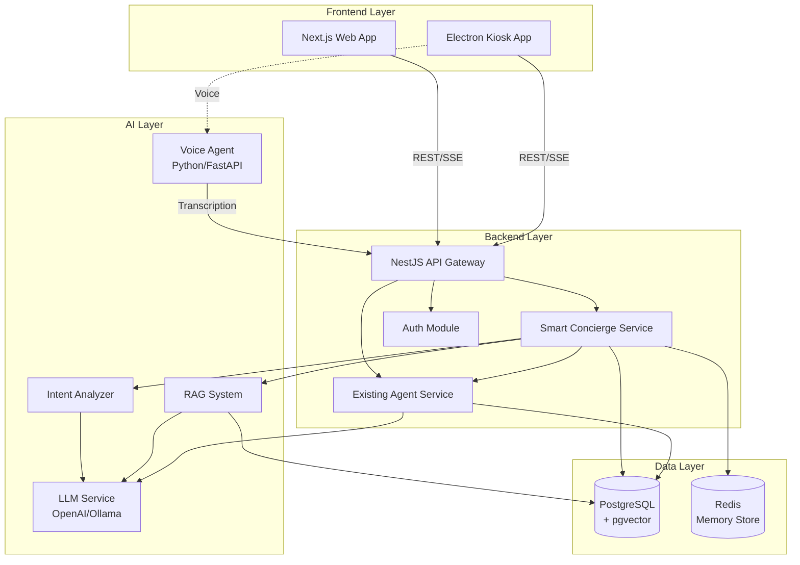
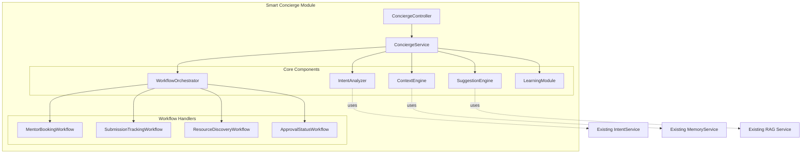

# Design Document: Smart Concierge

## Overview

The Smart Concierge feature adds an intelligent conversational interface to the Campus Resource Management system, enabling users to interact naturally through text or voice across web and kiosk platforms. The system analyzes user intent, maintains contextual awareness, and guides users through common workflows like mentor booking, submission tracking, resource discovery, and approval monitoring.

The design leverages existing infrastructure including the NestJS agent service (IntentService, MemoryService, RAG), voice-agent microservice (STT/TTS), and Prisma database schema. The Smart Concierge extends the current agent capabilities with enhanced intent classification, workflow orchestration, personalized suggestions, and cross-platform integration.

### Key Design Principles

1. **Leverage Existing Infrastructure**: Reuse IntentService, MemoryService, RAG, and voice-agent rather than rebuilding
2. **Minimal Schema Changes**: Extend existing models with optional fields rather than creating new tables
3. **Backward Compatibility**: Maintain existing agent endpoints (/recommend, /chat, /answer) without breaking changes
4. **Stateless Design**: Store all state in database/Redis for horizontal scalability
5. **Progressive Enhancement**: Provide degraded functionality when AI services are unavailable

## Architecture

### System Context



### Component Architecture



## Components and Interfaces

### 1. ConciergeController

**Responsibility**: HTTP endpoint handling for Smart Concierge interactions

**Endpoints**:

```typescript
@Controller('concierge')
export class ConciergeController {
  // Main interaction endpoint
  @Post('query')
  async processQuery(@Body() dto: ConciergeQueryDto): Promise<ConciergeResponse>
  
  // Get contextual suggestions
  @Get('suggestions')
  async getSuggestions(@Query('userId') userId: string): Promise<SuggestionResponse>
  
  // Workflow management
  @Post('workflow/start')
  async startWorkflow(@Body() dto: StartWorkflowDto): Promise<WorkflowState>
  
  @Post('workflow/step')
  async executeWorkflowStep(@Body() dto: WorkflowStepDto): Promise<WorkflowState>
  
  @Get('workflow/:workflowId')
  async getWorkflowState(@Param('workflowId') id: string): Promise<WorkflowState>
  
  @Delete('workflow/:workflowId')
  async cancelWorkflow(@Param('workflowId') id: string): Promise<void>
  
  // Learning and feedback
  @Post('feedback')
  async submitFeedback(@Body() dto: FeedbackDto): Promise<void>
  
  // Voice integration
  @Post('voice/process')
  async processVoiceQuery(@Body() dto: VoiceQueryDto): Promise<ConciergeResponse>
}
```

**DTOs**:

```typescript
interface ConciergeQueryDto {
  query: string;
  userId: string;
  projectId?: string;
  platform: 'web' | 'kiosk';
  inputMode: 'text' | 'voice';
  sessionId?: string;
}

interface ConciergeResponse {
  intent: IntentClassification;
  response: string;
  suggestions: Suggestion[];
  actions: QuickAction[];
  workflowState?: WorkflowState;
  confidence: number;
}

interface IntentClassification {
  type: string;
  entities: Record<string, any>;
  confidence: number;
  needsClarification: boolean;
  clarificationPrompt?: string;
}

interface Suggestion {
  id: string;
  title: string;
  description: string;
  action: string;
  relevanceScore: number;
  category: 'workflow' | 'information' | 'action';
}

interface QuickAction {
  id: string;
  label: string;
  type: 'navigate' | 'execute' | 'workflow';
  payload: any;
}

interface WorkflowState {
  workflowId: string;
  type: string;
  currentStep: number;
  totalSteps: number;
  stepData: any;
  completed: boolean;
  canResume: boolean;
}
```

### 2. ConciergeService

**Responsibility**: Core orchestration logic for Smart Concierge

**Interface**:

```typescript
@Injectable()
export class ConciergeService {
  constructor(
    private intentAnalyzer: IntentAnalyzer,
    private contextEngine: ContextEngine,
    private suggestionEngine: SuggestionEngine,
    private workflowOrchestrator: WorkflowOrchestrator,
    private learningModule: LearningModule,
    private prisma: PrismaService,
    private redis: RedisService
  ) {}
  
  async processQuery(dto: ConciergeQueryDto): Promise<ConciergeResponse>
  async generateSuggestions(userId: string, context: UserContext): Promise<Suggestion[]>
  async startWorkflow(type: string, userId: string, initialData: any): Promise<WorkflowState>
  async continueWorkflow(workflowId: string, stepData: any): Promise<WorkflowState>
  async recordInteraction(userId: string, interaction: InteractionRecord): Promise<void>
}
```

**Processing Pipeline**:

```typescript
async processQuery(dto: ConciergeQueryDto): Promise<ConciergeResponse> {
  // 1. Load user context
  const context = await this.contextEngine.getUserContext(dto.userId, dto.projectId);
  
  // 2. Classify intent
  const intent = await this.intentAnalyzer.classifyIntent(dto.query, context);
  
  // 3. Check if clarification needed
  if (intent.needsClarification) {
    return this.buildClarificationResponse(intent);
  }
  
  // 4. Check for active workflow
  const activeWorkflow = await this.workflowOrchestrator.getActiveWorkflow(dto.userId);
  if (activeWorkflow) {
    return this.continueWorkflowInteraction(activeWorkflow, dto.query, intent);
  }
  
  // 5. Determine if query should start a workflow
  if (this.shouldStartWorkflow(intent)) {
    const workflow = await this.workflowOrchestrator.startWorkflow(
      intent.type,
      dto.userId,
      intent.entities
    );
    return this.buildWorkflowResponse(workflow, context);
  }
  
  // 6. Generate direct response
  const response = await this.generateDirectResponse(intent, context);
  
  // 7. Generate contextual suggestions
  const suggestions = await this.suggestionEngine.generateSuggestions(context, intent);
  
  // 8. Record interaction for learning
  await this.learningModule.recordInteraction({
    userId: dto.userId,
    query: dto.query,
    intent: intent.type,
    confidence: intent.confidence,
    timestamp: new Date()
  });
  
  return {
    intent,
    response: response.text,
    suggestions,
    actions: response.quickActions,
    confidence: intent.confidence
  };
}
```

### 3. IntentAnalyzer

**Responsibility**: Enhanced intent classification with entity extraction

**Interface**:

```typescript
@Injectable()
export class IntentAnalyzer {
  constructor(
    private existingIntentService: IntentService,
    private llm: LLMService,
    private redis: RedisService
  ) {}
  
  async classifyIntent(query: string, context: UserContext): Promise<IntentClassification>
  async extractEntities(query: string, intentType: string): Promise<Record<string, any>>
  async validateIntent(intent: IntentClassification, context: UserContext): Promise<boolean>
}
```

**Intent Categories**:

```typescript
enum IntentType {
  // Workflow intents
  BOOK_MENTOR = 'book_mentor',
  TRACK_SUBMISSION = 'track_submission',
  FIND_RESOURCES = 'find_resources',
  CHECK_APPROVAL = 'check_approval',
  RESERVE_EQUIPMENT = 'reserve_equipment',
  SUBMIT_PURCHASE = 'submit_purchase',
  
  // Information intents
  VIEW_INVENTORY = 'view_inventory',
  GET_PROJECT_STATUS = 'get_project_status',
  LIST_MENTORS = 'list_mentors',
  VIEW_TASKS = 'view_tasks',
  
  // Action intents
  ADD_TASK = 'add_task',
  UPDATE_PROJECT = 'update_project',
  ADD_LOG = 'add_log',
  
  // Meta intents
  GET_HELP = 'get_help',
  CLARIFY = 'clarify',
  UNKNOWN = 'unknown'
}
```

**Classification Strategy**:

```typescript
async classifyIntent(query: string, context: UserContext): Promise<IntentClassification> {
  // 1. Check cache for similar queries
  const cached = await this.getCachedIntent(query);
  if (cached && cached.confidence > 0.9) {
    return cached;
  }
  
  // 2. Use existing IntentService for base classification
  const baseIntent = await this.existingIntentService.parse(query, {
    userId: context.userId,
    projectId: context.activeProjectId,
    recentActions: context.recentActions
  });
  
  // 3. If confidence is low, use enhanced LLM classification
  if (baseIntent.confidence < 0.7) {
    const enhancedIntent = await this.enhancedClassification(query, context);
    if (enhancedIntent.confidence > baseIntent.confidence) {
      return enhancedIntent;
    }
  }
  
  // 4. Extract entities for the classified intent
  const entities = await this.extractEntities(query, baseIntent.type);
  
  // 5. Validate intent against context
  const isValid = await this.validateIntent(
    { ...baseIntent, entities },
    context
  );
  
  if (!isValid) {
    return {
      type: IntentType.CLARIFY,
      entities: {},
      confidence: 0.5,
      needsClarification: true,
      clarificationPrompt: this.generateClarificationPrompt(baseIntent, context)
    };
  }
  
  // 6. Cache successful classification
  await this.cacheIntent(query, { ...baseIntent, entities });
  
  return {
    type: baseIntent.type,
    entities,
    confidence: baseIntent.confidence,
    needsClarification: false
  };
}
```

### 4. ContextEngine

**Responsibility**: Maintain and analyze user context for personalization

**Interface**:

```typescript
@Injectable()
export class ContextEngine {
  constructor(
    private prisma: PrismaService,
    private memoryService: MemoryService,
    private redis: RedisService
  ) {}
  
  async getUserContext(userId: string, projectId?: string): Promise<UserContext>
  async updateContext(userId: string, updates: Partial<UserContext>): Promise<void>
  async getRecentActions(userId: string, limit: number): Promise<UserAction[]>
  async getActiveWorkflows(userId: string): Promise<WorkflowState[]>
}
```

**UserContext Structure**:

```typescript
interface UserContext {
  userId: string;
  role: string;
  activeProjectId?: string;
  
  // Project context
  projects: {
    id: string;
    title: string;
    status: string;
    feasibilityScore?: number;
    missingResources: number;
    pendingTasks: number;
    lastActivity: Date;
  }[];
  
  // Pending items
  pendingApprovals: number;
  pendingReservations: number;
  pendingPurchases: number;
  
  // Recent activity
  recentActions: UserAction[];
  conversationHistory: ConversationMessage[];
  
  // Workflow state
  activeWorkflows: WorkflowState[];
  
  // Learning data
  frequentIntents: string[];
  preferredWorkflows: string[];
  interactionPatterns: InteractionPattern[];
}

interface UserAction {
  type: string;
  timestamp: Date;
  entityId?: string;
  metadata?: any;
}

interface InteractionPattern {
  pattern: string;
  frequency: number;
  lastOccurrence: Date;
  successRate: number;
}
```

**Context Loading Strategy**:

```typescript
async getUserContext(userId: string, projectId?: string): Promise<UserContext> {
  // 1. Check Redis cache
  const cached = await this.redis.get(`context:${userId}`);
  if (cached && this.isFresh(cached)) {
    return JSON.parse(cached);
  }
  
  // 2. Load from database
  const [user, projects, approvals, reservations, purchases, actions, patterns] = 
    await Promise.all([
      this.prisma.user.findUnique({ where: { id: userId } }),
      this.loadUserProjects(userId),
      this.loadPendingApprovals(userId),
      this.loadPendingReservations(userId),
      this.loadPendingPurchases(userId),
      this.getRecentActions(userId, 20),
      this.loadInteractionPatterns(userId)
    ]);
  
  // 3. Load conversation history from MemoryService
  const conversationHistory = this.memoryService.getHistory(projectId);
  
  // 4. Load active workflows
  const activeWorkflows = await this.getActiveWorkflows(userId);
  
  // 5. Build context object
  const context: UserContext = {
    userId,
    role: user.role,
    activeProjectId: projectId,
    projects,
    pendingApprovals: approvals.length,
    pendingReservations: reservations.length,
    pendingPurchases: purchases.length,
    recentActions: actions,
    conversationHistory: conversationHistory.messages,
    activeWorkflows,
    frequentIntents: this.extractFrequentIntents(patterns),
    preferredWorkflows: this.extractPreferredWorkflows(patterns),
    interactionPatterns: patterns
  };
  
  // 6. Cache for 5 minutes
  await this.redis.setex(`context:${userId}`, 300, JSON.stringify(context));
  
  return context;
}
```

### 5. SuggestionEngine

**Responsibility**: Generate contextual, personalized suggestions

**Interface**:

```typescript
@Injectable()
export class SuggestionEngine {
  constructor(
    private ragService: RagService,
    private llm: LLMService,
    private learningModule: LearningModule
  ) {}
  
  async generateSuggestions(
    context: UserContext,
    currentIntent?: IntentClassification
  ): Promise<Suggestion[]>
  
  async rankSuggestions(
    suggestions: Suggestion[],
    context: UserContext
  ): Promise<Suggestion[]>
  
  async generateWorkflowSuggestions(
    workflowType: string,
    currentStep: number
  ): Promise<Suggestion[]>
}
```

**Suggestion Generation Strategy**:

```typescript
async generateSuggestions(
  context: UserContext,
  currentIntent?: IntentClassification
): Promise<Suggestion[]> {
  const suggestions: Suggestion[] = [];
  
  // 1. Workflow-based suggestions
  if (context.activeWorkflows.length > 0) {
    const workflowSuggestions = await this.generateWorkflowSuggestions(
      context.activeWorkflows[0].type,
      context.activeWorkflows[0].currentStep
    );
    suggestions.push(...workflowSuggestions);
  }
  
  // 2. Context-based suggestions
  if (context.pendingApprovals > 0 && context.role === 'hod') {
    suggestions.push({
      id: 'review-approvals',
      title: 'Review Pending Approvals',
      description: `You have ${context.pendingApprovals} approvals waiting`,
      action: 'navigate:/approvals',
      relevanceScore: 0.95,
      category: 'action'
    });
  }
  
  if (context.projects.some(p => p.missingResources > 0)) {
    const project = context.projects.find(p => p.missingResources > 0);
    suggestions.push({
      id: 'submit-purchase',
      title: 'Submit Purchase Request',
      description: `${project.title} needs ${project.missingResources} resources`,
      action: 'workflow:submit_purchase',
      relevanceScore: 0.9,
      category: 'workflow'
    });
  }
  
  if (context.projects.some(p => p.pendingTasks > 0)) {
    const project = context.projects.find(p => p.pendingTasks > 0);
    suggestions.push({
      id: 'view-tasks',
      title: 'Review Pending Tasks',
      description: `${project.title} has ${project.pendingTasks} pending tasks`,
      action: 'navigate:/projects/${project.id}/tasks',
      relevanceScore: 0.85,
      category: 'action'
    });
  }
  
  // 3. Pattern-based suggestions (from learning)
  const learnedSuggestions = await this.learningModule.getSuggestionsForUser(
    context.userId,
    context
  );
  suggestions.push(...learnedSuggestions);
  
  // 4. Intent-based suggestions
  if (currentIntent) {
    const intentSuggestions = this.getIntentRelatedSuggestions(currentIntent);
    suggestions.push(...intentSuggestions);
  }
  
  // 5. RAG-based suggestions (knowledge base)
  const ragSuggestions = await this.generateRAGSuggestions(context);
  suggestions.push(...ragSuggestions);
  
  // 6. Rank and filter
  const ranked = await this.rankSuggestions(suggestions, context);
  
  // 7. Return top 5
  return ranked.slice(0, 5);
}
```

### 6. WorkflowOrchestrator

**Responsibility**: Manage multi-step workflow execution

**Interface**:

```typescript
@Injectable()
export class WorkflowOrchestrator {
  constructor(
    private mentorWorkflow: MentorBookingWorkflow,
    private trackingWorkflow: SubmissionTrackingWorkflow,
    private resourceWorkflow: ResourceDiscoveryWorkflow,
    private approvalWorkflow: ApprovalStatusWorkflow,
    private redis: RedisService,
    private prisma: PrismaService
  ) {}
  
  async startWorkflow(type: string, userId: string, initialData: any): Promise<WorkflowState>
  async executeStep(workflowId: string, stepData: any): Promise<WorkflowState>
  async getWorkflowState(workflowId: string): Promise<WorkflowState>
  async pauseWorkflow(workflowId: string): Promise<void>
  async resumeWorkflow(workflowId: string): Promise<WorkflowState>
  async cancelWorkflow(workflowId: string): Promise<void>
  async getActiveWorkflow(userId: string): Promise<WorkflowState | null>
}
```

**Workflow Base Class**:

```typescript
abstract class BaseWorkflow {
  abstract readonly type: string;
  abstract readonly steps: WorkflowStep[];
  
  async execute(state: WorkflowState, input: any): Promise<WorkflowState> {
    const currentStep = this.steps[state.currentStep];
    
    // Validate input
    const validation = await currentStep.validate(input);
    if (!validation.valid) {
      return {
        ...state,
        error: validation.error,
        needsInput: true
      };
    }
    
    // Execute step
    const result = await currentStep.execute(input, state);
    
    // Update state
    const newState: WorkflowState = {
      ...state,
      currentStep: state.currentStep + 1,
      stepData: { ...state.stepData, ...result },
      completed: state.currentStep + 1 >= this.steps.length,
      needsInput: false
    };
    
    return newState;
  }
  
  async getNextStepPrompt(state: WorkflowState): Promise<string> {
    if (state.completed) {
      return this.getCompletionMessage(state);
    }
    
    const nextStep = this.steps[state.currentStep];
    return nextStep.getPrompt(state);
  }
  
  abstract getCompletionMessage(state: WorkflowState): string;
}

interface WorkflowStep {
  name: string;
  validate(input: any): Promise<{ valid: boolean; error?: string }>;
  execute(input: any, state: WorkflowState): Promise<any>;
  getPrompt(state: WorkflowState): string;
}
```

**Example: MentorBookingWorkflow**:

```typescript
@Injectable()
export class MentorBookingWorkflow extends BaseWorkflow {
  readonly type = 'book_mentor';
  readonly steps: WorkflowStep[] = [
    new SearchMentorStep(this.prisma),
    new SelectMentorStep(this.prisma),
    new ScheduleSessionStep(this.prisma),
    new ConfirmBookingStep(this.prisma, this.notificationService)
  ];
  
  constructor(
    private prisma: PrismaService,
    private notificationService: NotificationService
  ) {
    super();
  }
  
  getCompletionMessage(state: WorkflowState): string {
    const mentor = state.stepData.selectedMentor;
    const schedule = state.stepData.schedule;
    return `✅ Mentor session booked with ${mentor.name} on ${schedule.date} at ${schedule.time}. You'll receive a confirmation email shortly.`;
  }
}

class SearchMentorStep implements WorkflowStep {
  name = 'search_mentor';
  
  constructor(private prisma: PrismaService) {}
  
  async validate(input: any): Promise<{ valid: boolean; error?: string }> {
    if (!input.query && !input.expertise) {
      return { valid: false, error: 'Please specify expertise area or mentor name' };
    }
    return { valid: true };
  }
  
  async execute(input: any, state: WorkflowState): Promise<any> {
    const mentors = await this.prisma.mentor.findMany({
      where: {
        available: true,
        OR: [
          { specialization: { has: input.expertise } },
          { user: { name: { contains: input.query, mode: 'insensitive' } } }
        ]
      },
      include: { user: true },
      take: 5
    });
    
    return { availableMentors: mentors };
  }
  
  getPrompt(state: WorkflowState): string {
    return 'What expertise area are you looking for? (e.g., IoT, Machine Learning, Web Development)';
  }
}
```

### 7. LearningModule

**Responsibility**: Track patterns and improve suggestions over time

**Interface**:

```typescript
@Injectable()
export class LearningModule {
  constructor(
    private prisma: PrismaService,
    private redis: RedisService
  ) {}
  
  async recordInteraction(interaction: InteractionRecord): Promise<void>
  async updatePatterns(userId: string): Promise<void>
  async getSuggestionsForUser(userId: string, context: UserContext): Promise<Suggestion[]>
  async getWorkflowSuccessRate(workflowType: string, userId?: string): Promise<number>
  async identifyAbandonedWorkflows(userId: string): Promise<WorkflowState[]>
}
```

**Pattern Tracking**:

```typescript
interface InteractionRecord {
  userId: string;
  query: string;
  intent: string;
  confidence: number;
  suggestionSelected?: string;
  workflowCompleted?: boolean;
  timestamp: Date;
}

async recordInteraction(interaction: InteractionRecord): Promise<void> {
  // 1. Store interaction in database
  await this.prisma.conciergeInteraction.create({
    data: {
      userId: interaction.userId,
      query: interaction.query,
      intent: interaction.intent,
      confidence: interaction.confidence,
      suggestionSelected: interaction.suggestionSelected,
      workflowCompleted: interaction.workflowCompleted,
      timestamp: interaction.timestamp
    }
  });
  
  // 2. Update real-time pattern cache
  await this.updateRealtimePatterns(interaction);
  
  // 3. Queue pattern analysis job (async)
  await this.queuePatternAnalysis(interaction.userId);
}

async updatePatterns(userId: string): Promise<void> {
  // 1. Load recent interactions (last 30 days)
  const interactions = await this.prisma.conciergeInteraction.findMany({
    where: {
      userId,
      timestamp: { gte: new Date(Date.now() - 30 * 24 * 60 * 60 * 1000) }
    },
    orderBy: { timestamp: 'desc' }
  });
  
  // 2. Analyze intent frequency
  const intentFrequency = this.calculateIntentFrequency(interactions);
  
  // 3. Analyze workflow completion rates
  const workflowStats = this.calculateWorkflowStats(interactions);
  
  // 4. Identify time-based patterns
  const timePatterns = this.identifyTimePatterns(interactions);
  
  // 5. Store patterns
  await this.prisma.userPattern.upsert({
    where: { userId },
    update: {
      intentFrequency,
      workflowStats,
      timePatterns,
      updatedAt: new Date()
    },
    create: {
      userId,
      intentFrequency,
      workflowStats,
      timePatterns
    }
  });
}
```

## Data Models

### Database Schema Extensions

```prisma
// Add to existing schema.prisma

model ConciergeInteraction {
  id                  String   @id @default(uuid())
  userId              String
  query               String
  intent              String
  confidence          Float
  suggestionSelected  String?
  workflowCompleted   Boolean?
  timestamp           DateTime @default(now())
  
  user                User     @relation(fields: [userId], references: [id])
  
  @@index([userId, timestamp])
  @@index([intent])
}

model WorkflowState {
  id          String   @id @default(uuid())
  userId      String
  type        String
  currentStep Int
  totalSteps  Int
  stepData    Json
  completed   Boolean  @default(false)
  paused      Boolean  @default(false)
  createdAt   DateTime @default(now())
  updatedAt   DateTime @updatedAt
  
  user        User     @relation(fields: [userId], references: [id])
  
  @@index([userId, completed])
}

model UserPattern {
  id               String   @id @default(uuid())
  userId           String   @unique
  intentFrequency  Json     // { intent: count }
  workflowStats    Json     // { workflow: { started, completed, abandoned } }
  timePatterns     Json     // { hour: activityCount }
  updatedAt        DateTime @updatedAt
  
  user             User     @relation(fields: [userId], references: [id])
}

// Extend existing User model
model User {
  // ... existing fields ...
  conciergeInteractions ConciergeInteraction[]
  workflowStates        WorkflowState[]
  userPattern           UserPattern?
}
```

### Redis Data Structures

```typescript
// User context cache
// Key: context:{userId}
// TTL: 300 seconds (5 minutes)
interface CachedUserContext {
  userId: string;
  context: UserContext;
  cachedAt: number;
}

// Intent classification cache
// Key: intent:{hash(query)}
// TTL: 3600 seconds (1 hour)
interface CachedIntent {
  query: string;
  intent: IntentClassification;
  cachedAt: number;
}

// Active workflow state
// Key: workflow:{workflowId}
// TTL: 86400 seconds (24 hours)
interface CachedWorkflowState {
  workflowId: string;
  state: WorkflowState;
  lastActivity: number;
}

// Real-time pattern tracking
// Key: patterns:{userId}
// TTL: 604800 seconds (7 days)
interface RealtimePatterns {
  userId: string;
  recentIntents: string[];  // Last 20 intents
  recentQueries: string[];  // Last 20 queries
  sessionStart: number;
}
```


## Correctness Properties

*A property is a characteristic or behavior that should hold true across all valid executions of a system—essentially, a formal statement about what the system should do. Properties serve as the bridge between human-readable specifications and machine-verifiable correctness guarantees.*

### Property 1: Intent Classification Completeness

*For any* user query (text or voice), the Intent_Analyzer should return a classification with a valid intent type from the supported categories, a confidence score between 0 and 1, and request clarification when confidence is below 0.7.

**Validates: Requirements 1.1, 1.2, 1.3**

### Property 2: Entity Extraction Consistency

*For any* query containing known entities (mentor names, resource types, project IDs, dates), the Intent_Analyzer should extract all entities that match the expected patterns for the classified intent type.

**Validates: Requirements 1.6**

### Property 3: Multi-Intent Detection

*For any* query containing multiple intent indicators, the Intent_Analyzer should identify both a primary intent and flag all secondary intents present in the query.

**Validates: Requirements 1.5**

### Property 4: Context Retrieval Completeness

*For any* user interaction, the Context_Engine should retrieve a User_Context containing all required fields: userId, role, projects list, pending counts (approvals, reservations, purchases), recent actions, and conversation history.

**Validates: Requirements 2.1, 5.2, 5.7, 6.2, 7.2**

### Property 5: Suggestion Generation Bounds

*For any* user context, the Suggestion_Engine should return between 3 and 5 suggestions, each with a relevance score between 0 and 1, ordered by descending relevance score.

**Validates: Requirements 2.3, 2.7**

### Property 6: Context-Aware Suggestion Prioritization

*For any* user context with pending approvals (and role = HOD), the Suggestion_Engine should include at least one approval-related suggestion in the top 3 suggestions.

**Validates: Requirements 2.4, 7.6**

### Property 7: Resource-Based Suggestions

*For any* user context where at least one project has missing resources, the Suggestion_Engine should include a purchase request or alternative resource suggestion.

**Validates: Requirements 2.5**

### Property 8: Inactivity Detection

*For any* user context where a project has no activity in the last 7 days, the Suggestion_Engine should include a progress update or mentor consultation suggestion for that project.

**Validates: Requirements 2.6**

### Property 9: Suggestion State Consistency

*For any* workflow state transition (step completion), generating suggestions before and after the transition should produce different suggestion sets that reflect the new state.

**Validates: Requirements 2.8**

### Property 10: Workflow State Progression

*For any* workflow, when a step is successfully completed, the workflow state should advance to the next step (currentStep increments by 1), update stepData with the step results, and correctly indicate completion status when reaching the final step.

**Validates: Requirements 3.2, 3.3, 3.8**

### Property 11: Workflow Input Validation

*For any* workflow step requiring input, providing invalid data should result in validation failure with a specific error message, and the workflow state should remain unchanged (currentStep does not increment).

**Validates: Requirements 3.4**

### Property 12: Workflow Error Recovery

*For any* workflow step that fails during execution, the system should return an error state with error details and recovery options, while preserving all previously completed step data.

**Validates: Requirements 3.5, 12.5**

### Property 13: Workflow Persistence

*For any* workflow that is paused, the workflow state should be persisted to the database, and resuming the workflow should restore the exact state including currentStep, stepData, and all metadata.

**Validates: Requirements 3.6, 3.7**

### Property 14: Mentor Search Filtering

*For any* mentor search query with expertise or name criteria, all returned mentors should match the search criteria and have available=true status.

**Validates: Requirements 4.8**

### Property 15: Mentor Availability Validation

*For any* mentor booking attempt, if the selected mentor is unavailable (available=false), the system should reject the booking and suggest alternative mentors or time slots.

**Validates: Requirements 4.4, 4.7**

### Property 16: Project Status Filtering

*For any* project list request with a status filter (active, pending, approved, completed), all returned projects should have a status matching the filter criteria.

**Validates: Requirements 5.6**

### Property 17: Resource Filtering Accuracy

*For any* resource discovery query with specified requirements (item type, minimum quantity), all returned resources should match the item type and have quantity >= requested quantity.

**Validates: Requirements 6.3**

### Property 18: Alternative Resource Suggestions

*For any* resource request where the exact item is unavailable (quantity = 0 or item not found), the system should return at least one alternative resource suggestion with similar characteristics.

**Validates: Requirements 6.4**

### Property 19: Approval Timeline Estimation

*For any* pending approval, the system should provide an estimated timeline based on historical data, and the estimate should be a positive number of days.

**Validates: Requirements 7.3, 5.3**

### Property 20: Cross-Platform State Consistency

*For any* user session, starting a workflow on one platform (web) and continuing on another platform (kiosk) should maintain identical workflow state including currentStep, stepData, and completion status.

**Validates: Requirements 8.1, 8.4**

### Property 21: Voice Transcription Display

*For any* voice input processed by the system, the response should include the transcription text for user confirmation before processing the intent.

**Validates: Requirements 8.7**

### Property 22: Interaction Recording Completeness

*For any* user interaction with the Smart_Concierge, the Learning_Module should record an interaction entry containing userId, query, intent, confidence, and timestamp.

**Validates: Requirements 9.1**

### Property 23: Pattern Persistence

*For any* user with recorded interactions, the User_Patterns should persist across sessions, and retrieving patterns after a session restart should return the same pattern data.

**Validates: Requirements 9.2**

### Property 24: Pattern-Influenced Suggestions

*For any* user with established patterns (frequent intents), generating suggestions should weight recommendations toward the user's frequent intent categories more heavily than for users without patterns.

**Validates: Requirements 9.3**

### Property 25: Workflow Abandonment Detection

*For any* workflow that remains incomplete for more than 24 hours, the Learning_Module should flag it as abandoned and include it in the abandonment patterns.

**Validates: Requirements 9.6**

### Property 26: Privacy-Preserving Pattern Storage

*For any* User_Pattern record, the stored data should not contain personally identifiable information (PII) such as email addresses, full names, or specific project titles in the pattern fields.

**Validates: Requirements 9.7**

### Property 27: Async Pattern Updates

*For any* interaction that triggers pattern updates, the user request should complete and return a response before the pattern update completes, demonstrating non-blocking behavior.

**Validates: Requirements 9.8, 11.6**

### Property 28: Backward Compatibility

*For any* existing agent endpoint (/recommend, /chat, /answer), calling the endpoint with valid parameters should return a successful response with the expected schema, unchanged from pre-Smart-Concierge behavior.

**Validates: Requirements 10.8**

### Property 29: Response Time Performance

*For any* query to the Smart_Concierge, 95% of requests should receive an intent classification within 2 seconds and suggestions within 1 second (measured over 100 requests).

**Validates: Requirements 11.1, 11.2**

### Property 30: Cache Effectiveness

*For any* repeated request for the same user context or intent classification within the cache TTL period, the second request should be served from cache (faster response time and no database query).

**Validates: Requirements 11.4**

### Property 31: Rate Limiting Enforcement

*For any* user making more than 60 requests in a 60-second window, the 61st request should be rejected with a 429 status code and rate limit error message.

**Validates: Requirements 11.5**

### Property 32: Circuit Breaker Activation

*For any* external service (voice-agent, AI provider) that fails 5 consecutive times, the circuit breaker should open and subsequent requests should use fallback behavior without attempting to call the failing service.

**Validates: Requirements 11.8**

### Property 33: Graceful Degradation

*For any* scenario where the AI provider is unavailable, the system should still process queries using rule-based intent detection and return responses with clear indication of degraded mode.

**Validates: Requirements 12.1, 12.2, 12.3**

### Property 34: Error Logging Completeness

*For any* error that occurs during request processing, an error log entry should be created containing timestamp, error type, error message, user context, and stack trace.

**Validates: Requirements 12.4**

### Property 35: Input Validation Specificity

*For any* invalid user input (malformed data, missing required fields, out-of-range values), the system should reject the input and return a specific error message indicating which field is invalid and why.

**Validates: Requirements 12.6**

### Property 36: Operation Timeout Enforcement

*For any* operation that exceeds 30 seconds, the system should terminate the operation and return a timeout error with information about the operation that timed out.

**Validates: Requirements 12.7**

### Property 37: Voice Recognition Fallback

*For any* voice input that fails transcription (empty result or error from voice-agent), the system should prompt the user to retry voice input or switch to text input mode.

**Validates: Requirements 12.8**

## Error Handling

### Error Categories

1. **Intent Classification Errors**
   - Low confidence (< 0.7): Request clarification
   - Unknown intent: Provide help menu with available actions
   - Entity extraction failure: Ask for specific missing information

2. **Workflow Errors**
   - Invalid input: Show validation error and retry prompt
   - Step execution failure: Preserve state, show error, offer recovery options
   - Workflow not found: Clear stale workflow references, start fresh

3. **External Service Errors**
   - Voice-agent unavailable: Fall back to text input
   - AI provider unavailable: Use rule-based responses
   - Database unavailable: Return cached data if available, otherwise error
   - API timeout: Retry with exponential backoff (max 3 attempts)

4. **Data Errors**
   - Missing user context: Load minimal context, request user to complete profile
   - Invalid project ID: Return error with list of valid projects
   - Resource not found: Suggest similar resources or search

### Error Response Format

```typescript
interface ErrorResponse {
  error: {
    code: string;
    message: string;
    details?: any;
    recoveryOptions?: RecoveryOption[];
  };
  fallbackResponse?: string;
}

interface RecoveryOption {
  action: string;
  label: string;
  description: string;
}
```

### Circuit Breaker Configuration

```typescript
interface CircuitBreakerConfig {
  failureThreshold: 5;        // Open after 5 failures
  successThreshold: 2;        // Close after 2 successes
  timeout: 30000;             // 30 second timeout
  resetTimeout: 60000;        // Try again after 1 minute
}
```

### Retry Strategy

```typescript
interface RetryConfig {
  maxAttempts: 3;
  initialDelay: 1000;         // 1 second
  maxDelay: 10000;            // 10 seconds
  backoffMultiplier: 2;       // Exponential backoff
  retryableErrors: [
    'TIMEOUT',
    'SERVICE_UNAVAILABLE',
    'NETWORK_ERROR'
  ];
}
```

## Testing Strategy

### Dual Testing Approach

The Smart Concierge feature requires both unit tests and property-based tests for comprehensive coverage:

**Unit Tests** focus on:
- Specific workflow examples (booking a mentor with known data)
- Integration points (voice-agent STT, existing agent service)
- Edge cases (empty results, boundary conditions)
- Error conditions (service failures, invalid inputs)

**Property-Based Tests** focus on:
- Universal properties across all inputs (intent classification bounds, suggestion counts)
- State consistency (workflow progression, context updates)
- Performance characteristics (response times, cache effectiveness)
- Data integrity (pattern persistence, error logging)

### Property-Based Testing Configuration

**Framework**: Use `fast-check` for TypeScript property-based testing

**Configuration**:
- Minimum 100 iterations per property test
- Each test tagged with feature name and property number
- Tag format: `Feature: smart-concierge, Property {N}: {property_text}`

**Example Property Test**:

```typescript
import fc from 'fast-check';

describe('Smart Concierge Properties', () => {
  // Feature: smart-concierge, Property 1: Intent Classification Completeness
  it('should return valid intent classification for any query', async () => {
    await fc.assert(
      fc.asyncProperty(
        fc.string({ minLength: 1, maxLength: 500 }),
        fc.uuid(),
        async (query, userId) => {
          const result = await conciergeService.processQuery({
            query,
            userId,
            platform: 'web',
            inputMode: 'text'
          });
          
          // Verify intent is from supported categories
          expect(SUPPORTED_INTENTS).toContain(result.intent.type);
          
          // Verify confidence score is in valid range
          expect(result.intent.confidence).toBeGreaterThanOrEqual(0);
          expect(result.intent.confidence).toBeLessThanOrEqual(1);
          
          // Verify clarification logic
          if (result.intent.confidence < 0.7) {
            expect(result.intent.needsClarification).toBe(true);
            expect(result.intent.clarificationPrompt).toBeDefined();
          }
        }
      ),
      { numRuns: 100 }
    );
  });
  
  // Feature: smart-concierge, Property 5: Suggestion Generation Bounds
  it('should return 3-5 suggestions with valid relevance scores', async () => {
    await fc.assert(
      fc.asyncProperty(
        fc.uuid(),
        fc.record({
          projects: fc.array(fc.record({
            id: fc.uuid(),
            title: fc.string(),
            status: fc.constantFrom('active', 'pending', 'approved'),
            missingResources: fc.nat(10),
            pendingTasks: fc.nat(20)
          })),
          pendingApprovals: fc.nat(10),
          role: fc.constantFrom('student', 'hod', 'admin')
        }),
        async (userId, contextData) => {
          const context = await contextEngine.getUserContext(userId);
          const suggestions = await suggestionEngine.generateSuggestions(context);
          
          // Verify count bounds
          expect(suggestions.length).toBeGreaterThanOrEqual(3);
          expect(suggestions.length).toBeLessThanOrEqual(5);
          
          // Verify relevance scores
          suggestions.forEach(suggestion => {
            expect(suggestion.relevanceScore).toBeGreaterThanOrEqual(0);
            expect(suggestion.relevanceScore).toBeLessThanOrEqual(1);
          });
          
          // Verify ordering
          for (let i = 1; i < suggestions.length; i++) {
            expect(suggestions[i-1].relevanceScore)
              .toBeGreaterThanOrEqual(suggestions[i].relevanceScore);
          }
        }
      ),
      { numRuns: 100 }
    );
  });
});
```

### Unit Test Examples

```typescript
describe('MentorBookingWorkflow', () => {
  it('should retrieve available mentors when workflow starts', async () => {
    const workflow = await workflowOrchestrator.startWorkflow(
      'book_mentor',
      'user-123',
      { expertise: 'IoT' }
    );
    
    expect(workflow.stepData.availableMentors).toBeDefined();
    expect(workflow.stepData.availableMentors.length).toBeGreaterThan(0);
    expect(workflow.stepData.availableMentors[0]).toHaveProperty('specialization');
  });
  
  it('should reject booking for unavailable mentor', async () => {
    const mentor = await createTestMentor({ available: false });
    
    const result = await mentorWorkflow.execute(
      { currentStep: 1, stepData: { selectedMentor: mentor } },
      { confirm: true }
    );
    
    expect(result.error).toBeDefined();
    expect(result.error).toContain('unavailable');
  });
});

describe('Voice Integration', () => {
  it('should forward voice input to voice-agent service', async () => {
    const voiceData = createTestAudioBlob();
    
    const result = await conciergeController.processVoiceQuery({
      audio: voiceData,
      userId: 'user-123',
      platform: 'kiosk',
      inputMode: 'voice'
    });
    
    expect(voiceAgentService.transcribe).toHaveBeenCalledWith(voiceData);
    expect(result.intent.transcription).toBeDefined();
  });
});
```

### Integration Test Strategy

1. **End-to-End Workflow Tests**: Test complete workflows from start to finish
2. **Cross-Platform Tests**: Verify state consistency between web and kiosk
3. **Service Integration Tests**: Test integration with voice-agent, existing agent service, RAG
4. **Performance Tests**: Measure response times under realistic load
5. **Resilience Tests**: Verify graceful degradation when services fail

### Test Data Generation

Use factories for consistent test data:

```typescript
const userContextFactory = {
  create: (overrides?: Partial<UserContext>): UserContext => ({
    userId: faker.string.uuid(),
    role: faker.helpers.arrayElement(['student', 'hod', 'admin']),
    projects: [],
    pendingApprovals: 0,
    pendingReservations: 0,
    pendingPurchases: 0,
    recentActions: [],
    conversationHistory: [],
    activeWorkflows: [],
    frequentIntents: [],
    preferredWorkflows: [],
    interactionPatterns: [],
    ...overrides
  })
};
```

### Coverage Goals

- Unit test coverage: > 80%
- Property test coverage: All 37 correctness properties
- Integration test coverage: All workflow types and external integrations
- E2E test coverage: Critical user journeys (mentor booking, submission tracking)
